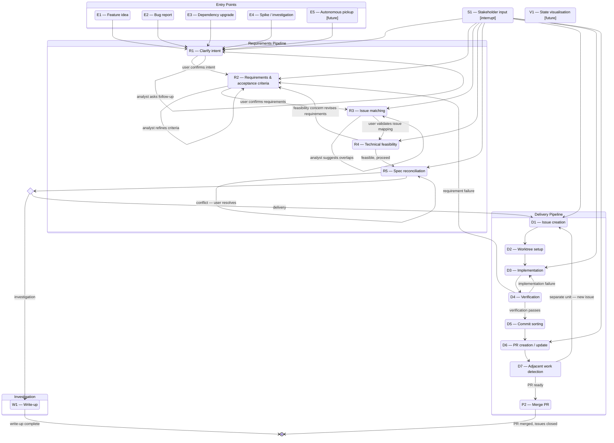

# rose

Installs and manages Claude Code configuration.

## Prerequisites

**GitHub CLI** authenticated: `gh auth login` — rose uses `gh` for all GitHub operations. Run this once per host.

## Setup

Add this function to your `~/.zshrc`:

```bash
rose() {
  docker run --rm -it \
    -v "$(pwd):/project" \
    -v "$HOME/.claude:/claude" \
    -v "$HOME/.ssh:/root/.ssh:ro" \
    -e GITHUB_TOKEN="$(gh auth token 2>/dev/null)" \
    rose:latest "$@"
}
```

Then reload:

```bash
source ~/.zshrc
```

### Developer setup

If you're working on rose itself, set `ROSE_DEV` to the repo path. The function will use `docker compose` (which rebuilds on source changes) instead of the published image:

```bash
export ROSE_DEV="$HOME/rose"

rose() {
  local cmd="${1:-help}"
  if [[ -n "${ROSE_DEV:-}" ]]; then
    TARGET_PROJECT="$(pwd)" GITHUB_TOKEN="$(gh auth token 2>/dev/null)" \
      docker compose --progress quiet -f "$ROSE_DEV/compose.yml" run --rm rose "$cmd" "${@:2}"
  else
    docker run --rm -it \
      -v "$(pwd):/project" \
      -v "$HOME/.claude:/claude" \
      -v "$HOME/.ssh:/root/.ssh:ro" \
      -e GITHUB_TOKEN="$(gh auth token 2>/dev/null)" \
      rose:latest "$cmd" "${@:2}"
  fi
}
```

Unset `ROSE_DEV` (or don't set it) to use the published image like a regular client.

## Commands

| Command | Does |
|---|---|
| `rose install` | Install global Claude config onto host (`~/.claude`) |
| `rose reinstall` | Wipe `~/.claude` and reinstall from scratch |
| `rose remove` | Remove rose Claude setup from current project |
| `rose uninstall` | Remove rose config from `~/.claude` |

### rose install

Run once per host. Installs to `~/.claude`:

```
~/.claude/
├── CLAUDE.md                       # global persona and tone
├── settings.json                   # env vars + lifecycle hooks
├── hooks/
│   └── post-write-validate.sh      # lints every file after Write/Edit
├── agents/
│   ├── git-agent.md                # commit and push operations
│   ├── analyst-agent.md            # feature analysis and scoping
│   └── gh-agent.md                 # GitHub issue + branch creation
└── commands/
    ├── git.md                      # /git commit, /git push, /git commit push
    ├── feature.md                  # /feature
    ├── issue.md                    # /issue
    └── commit.md                   # /commit
```

```bash
rose install          # install into ~/.claude
rose install --force  # overwrite existing files
rose reinstall        # wipe ~/.claude and reinstall from scratch
```

### rose remove

Removes `.claude/agents/` and `CLAUDE.md` from the current project.

```bash
rose remove      # prompts for confirmation
rose remove -y   # skip confirmation
```

### rose uninstall

Removes rose's global config from `~/.claude`.

```bash
rose uninstall      # prompts for confirmation
rose uninstall -y   # skip confirmation
```

## Feature Lifecycle

Rose implements a structured engineering workflow as a state machine. Every unit of work — feature, bug fix, dependency upgrade, or investigation — passes through the same pipeline.



See [CLAUDE.md](CLAUDE.md) for the full process specification with actors, triggers, inputs, outputs, and exit conditions for each step.

## This repo IS the config

The `global/` directory is the source of truth. All definitions flow via `rose install`:

```
global/  →  rose install  →  ~/.claude/
```

Never edit `~/.claude` directly — changes are overwritten on the next `rose reinstall`.

## Build

```bash
docker build -t rose .
```

---

For a full explanation of Claude Code's configuration primitives — settings.json, hooks, agents, slash commands, CLAUDE.md — see [docs/reference.md](docs/reference.md).
